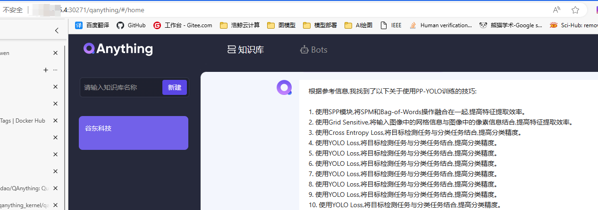
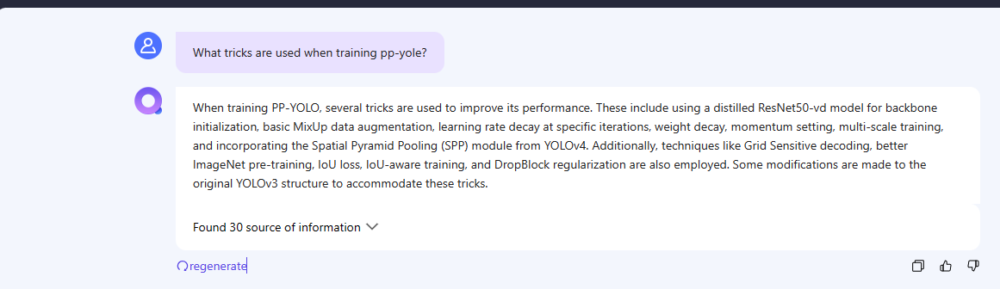

#  谷东科技笔试题代码 

## 1、最大炸弹覆盖问题：
    python bombs.py 
## 2、使用QanyThing构建RAG：

- 启动Qwen2-0.5大模型：
  - 下载对应的Qwen模型: python vllm/download_model.py
  - 启动Qwen2-0.5大模型： bash vllm/run_qwen0.5B_vllm.sh
- 进入QAnything中启动RAG服务：bash scripts/run_for_openai_api_with_gpu_in_Linux_or_WSL.sh
  - 传入paper:《PP-YOLO: An Effective and Efficient Implementation of Object Detector》
  - 输入问题：What tricks are used when training pp-yole?
  - 使用QWen2-0.5B模型结果：
      
  - 使用QWen1.5-32B-int4模型结果：
      
- 
